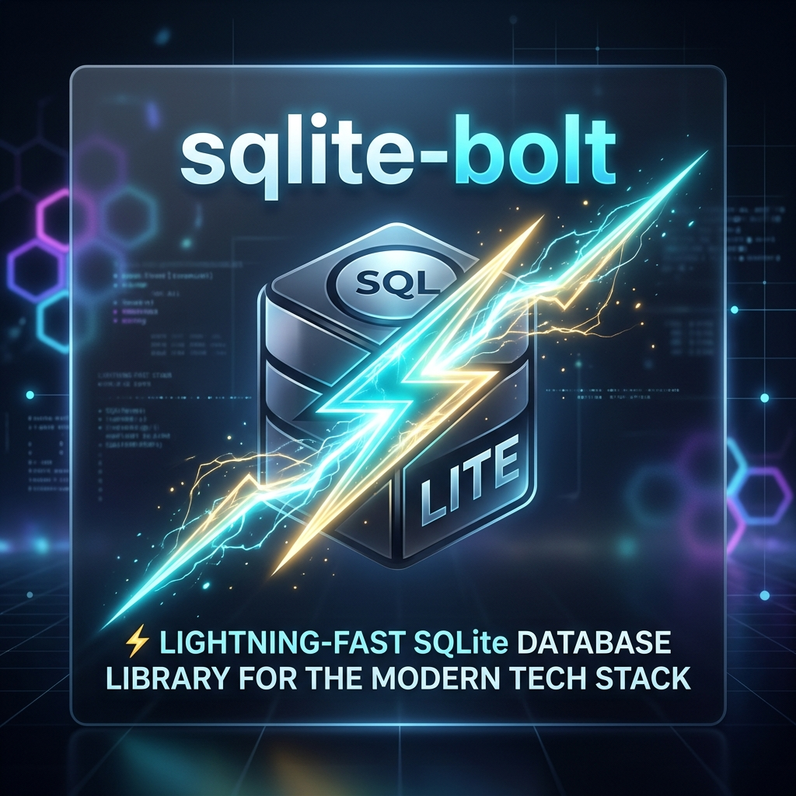

<p align="center">
  
</p>

<h1 align="center">📖 sqlite-bolt — Comprehensive Usage Guide</h1>

<p align="center">
  <b>Complete Developer Manual & API Reference for <code>@bolt/sqlite</code></b><br>
  <i>Active Record ORM • Fluent QueryBuilder • Cross-Platform Drivers • Offline Sync Engine</i>
</p>

---

## 🧭 Navigation Index

| Section | Description |
| :--- | :--- |
| 1. [Installation & Driver Setup](#1-installation--driver-setup) | Installing via Git/npm and platform peer drivers (`@capacitor-community/sqlite`, `sql.js`). |
| 2. [Project Bootstrap & Config](#2-project-bootstrap--database-configuration) | Initializing database connections, `BoltConfig` options, and static registry registration. |
| 3. [Standalone QueryBuilder](#3-standalone-querybuilder) | `SELECT`, `WHERE`, `JOIN`, aggregations, pagination, mutations, `UPSERT`, and query explain. |
| 4. [CI4 Active Record BoltModel](#4-ci4-active-record-boltmodel) | Model definitions, TypeScript strict overrides, callbacks, soft deletes, and entity patterns. |
| 5. [Relations & Eager Loading](#5-relations--eager-loading) | `belongsTo`, `hasMany`, `hasOne`, eager loading (`with()`), and lazy hydration (`hydrate()`). |
| 6. [Migrations & Schema Builder](#6-migrations--schema-builder) | Versioned schema migration runner, table definitions, column types, and schema alterations. |
| 7. [Schema Introspection API](#7-schema-introspection-api) | Runtime database metadata inspection (`tables`, `columns`, `indexes`, `foreignKeys`). |
| 8. [ACID Transactions](#8-acid-transactions) | Multi-query atomic transactions with automated error rollback (`Bolt.db().transaction()`). |
| 9. [Validation System](#9-validation-system) | Built-in rules, custom synchronous & async validation, `validate()` and `validateOrFail()`. |
| 10. [Offline & Sync Engine](#10-offline--sync-engine) | Change tracking (`_bolt_changes`), offline queue, sync push/pull adapter, and background sync. |
| 11. [Multi-Database Setup](#11-multi-database-setup) | Managing multiple concurrent SQLite database connections using `dbGroup`. |
| 12. [Native Android Integration](#12-native-android-integration-java--kotlin) | Querying database directly from Android background services using `BoltNativeDb` (Java/Kotlin). |
| 13. [Developer Experience & Debugging](#13-developer-experience--debugging) | SQL logger, query execution duration, `.explain()`, and busy lock retry backoff configurations. |
| 14. [Error Handling & Troubleshooting](#14-error-handling--troubleshooting) | `BoltError` exception hierarchy and comprehensive troubleshooting matrix. |
| 15. [Quick Reference Card](#15-quick-reference-card) | Copy-pasteable syntax cheat sheet for common operations. |

---

## 1. Installation & Driver Setup

### Step 1: Install Package

Install `@bolt/sqlite` directly from the Git repository:

```bash
npm install git+https://github.com/pioneersingh321/sqlite-bolt.git
```

Or when installed from local source / npm registry:

```bash
npm install @bolt/sqlite
```

### Step 2: Install Platform Drivers

`@bolt/sqlite` uses peer dependencies for database drivers. Install the driver required for your target platform:

#### 📱 Mobile (Capacitor for iOS / Android)
```bash
npm install @capacitor-community/sqlite
```

#### 🌐 Web (Browser WASM with OPFS + IndexedDB fallback)
```bash
npm install sql.js
npm install --save-dev @types/sql.js
```

> [!NOTE]
> Web builds use WebAssembly (`sql.js`) with Origin Private File System (OPFS) and IndexedDB fallbacks for persistent local browser storage.

---

## 2. Project Bootstrap & Database Configuration

Initialize and register your database connection during application startup (e.g., `main.ts`, `app.component.ts`, or a dedicated `database/bootstrap.ts`).

### Configuration Options (`BoltConfig`)

| Option | Type | Default | Description |
| :--- | :--- | :--- | :--- |
| `dbName` | `string` | **(Required)** | Name of the SQLite database file (e.g., `'app_v1'`). |
| `driver` | `'capacitor' \| 'web' \| 'electron'` | **(Required)** | Target SQLite platform driver. |
| `dbLocation` | `string` | `undefined` | Custom location path for mobile or electron storage. |
| `version` | `number` | `1` | Schema version number for automatic migration execution. |
| `migrations` | `Migration[]` | `[]` | Array of versioned schema migration definitions. |
| `debug` | `boolean` | `false` | Log formatted SQL queries and execution duration to console. |
| `camelCase` | `boolean` | `false` | Automatically transform DB snake_case columns to camelCase in object results. |
| `cache` | `{ enabled: boolean; ttl: number; maxSize: number }` | `undefined` | Query result caching parameters. |
| `sqlJsWasmPath` | `string` | `undefined` | Custom URL/path to `sql-wasm.wasm` file for web builds. |
| `encrypted` | `boolean` | `false` | Enable SQLCipher database encryption (Capacitor driver). |
| `secret` | `string` | `undefined` | Encryption passphrase for encrypted databases. |
| `biometricAuth` | `boolean` | `false` | Require biometric authentication before unlocking database (Capacitor). |
| `retry` | `RetryConfig` | `undefined` | Automatic retry config on busy/locked errors (`maxRetries`, `delayMs`, `backoff`). |
| `sync` | `SyncConfig` | `undefined` | Offline synchronization engine configuration (`endpoint`, `conflictStrategy`, etc.). |

### Bootstrap Example

```typescript
// database/bootstrap.ts
import { Bolt } from '@bolt/sqlite';
import { m001_create_users } from './migrations/001_create_users';
import { m002_create_orders } from './migrations/002_create_orders';

export async function initDatabase() {
  const db = await Bolt.create({
    dbName: 'app_v1',
    driver: 'capacitor', // Options: 'capacitor' | 'web' | 'electron'
    version: 2,
    migrations: [m001_create_users, m002_create_orders],
    debug: true,
    retry: {
      maxRetries: 5,
      delayMs: 100,
      backoff: 'exponential'
    }
  });

  // Register as 'default' connection in static registry
  Bolt.addConnection('default', db);
  console.log('[Bolt] Database initialized successfully.');
}
```

```typescript
// main.ts
import { initDatabase } from './database/bootstrap';

initDatabase().then(() => {
  // Start UI application framework
});
```

---

## 3. Standalone QueryBuilder

The QueryBuilder can be used directly for ad-hoc queries, reporting, custom joins, aggregations, and raw SQL execution without declaring a model class.

### SELECT & WHERE Clauses

```typescript
import { Bolt } from '@bolt/sqlite';

// Basic SELECT with filtering and sorting
const activeUsers = await Bolt.table('users')
  .select('id', 'name', 'email')
  .where('status', 'active')
  .orderBy('created_at', 'DESC')
  .get();

// First matching row
const admin = await Bolt.table('users')
  .where('role', 'admin')
  .first();

// WHERE IN / NOT IN
const targetRoles = await Bolt.table('users')
  .whereIn('role', ['admin', 'editor', 'manager'])
  .whereNotIn('status', ['suspended', 'banned'])
  .get();

// LIKE Search
const searchResults = await Bolt.table('products')
  .whereLike('name', '%laptop%')
  .orLike('description', '%laptop%')
  .get();

// NULL checks & BETWEEN
const verified = await Bolt.table('users')
  .whereNotNull('email_verified_at')
  .whereBetween('age', [18, 65])
  .get();

// Raw WHERE conditions
const recentLogs = await Bolt.table('logs')
  .whereRaw("created_at > datetime('now', '-7 days')")
  .where('level', 'error')
  .get();
```

### JOINs & Aggregations

```typescript
// INNER JOIN
const orders = await Bolt.table('orders')
  .select('orders.id', 'orders.total', 'users.name as customer_name')
  .join('users', 'orders.user_id = users.id')
  .where('orders.status', 'pending')
  .get();

// LEFT JOIN with GROUP BY & HAVING
const userOrderCounts = await Bolt.table('users')
  .select('users.id', 'users.name', 'COUNT(orders.id) as order_count')
  .leftJoin('orders', 'users.id = orders.user_id')
  .groupBy('users.id')
  .having('order_count', '>', 5)
  .get();

// Aggregation Methods
const totalUsers = await Bolt.table('users').countAllResults();

const metrics = await Bolt.table('orders')
  .selectSum('total', 'revenue')
  .selectAvg('total', 'avg_order')
  .selectMin('total', 'min_order')
  .selectMax('total', 'max_order')
  .where('status', 'completed')
  .first();
```

### Pagination

```typescript
// Pagination helper: page(pageNumber, perPage)
const page1 = await Bolt.table('products')
  .where('stock', '>', 0)
  .orderBy('name', 'ASC')
  .page(1, 20)
  .get();
```

### Mutations (INSERT, UPDATE, DELETE, UPSERT)

```typescript
// Single INSERT
const newId = await Bolt.table('users').insert({
  name: 'John Doe',
  email: 'john@example.com',
  role: 'user'
});

// Batch INSERT in chunked transactions
await Bolt.table('logs').insertBatch([
  { level: 'info', message: 'User logged in' },
  { level: 'warn', message: 'Disk space low' }
], 100);

// UPDATE
await Bolt.table('users')
  .set('status', 'suspended')
  .where('last_login', '<', '2024-01-01')
  .update();

// DELETE
await Bolt.table('sessions')
  .where('expires_at', '<', new Date().toISOString())
  .delete();

// UPSERT (INSERT ... ON CONFLICT DO UPDATE)
await Bolt.table('users').upsert({
  id: 1,
  name: 'Updated Name',
  email: 'updated@example.com'
}, 'id');
```

### Raw SQL & EXPLAIN

```typescript
// Raw SELECT query
const rows = await Bolt.query<User>(
  'SELECT * FROM users WHERE status = ? AND age >= ?',
  ['active', 21]
);

// Raw execute statement
await Bolt.execute('UPDATE inventory SET stock = stock - ? WHERE id = ?', [2, 101]);

// Query Plan Inspection
const queryPlan = await Bolt.table('users')
  .where('email', 'admin@example.com')
  .explain();
```

---

## 4. CI4 Active Record BoltModel

`BoltModel<T>` provides full Active Record capability including soft deletes, automatic timestamps, lifecycle callbacks, and validation.

### Model Definition

```typescript
import { BoltModel, rule } from '@bolt/sqlite';

export interface User {
  id: number;
  name: string;
  email: string;
  role: 'admin' | 'user';
  status: 'active' | 'suspended';
  created_at?: string;
  updated_at?: string;
  deleted_at?: string | null;
}

export class UserModel extends BoltModel<User> {
  protected override table = 'users';
  protected override primaryKey = 'id';
  protected override allowedFields = ['name', 'email', 'role', 'status'];
  protected override softDelete = true;
  protected override timestamps = true;

  protected override validationRules = {
    name: [rule.required(), rule.minLength(2)],
    email: [rule.required(), rule.email(), rule.unique('users', 'email')],
    role: [rule.inArray(['admin', 'user'])],
  };

  // Lifecycle Callbacks
  protected override async beforeInsert(data: Partial<User>) {
    if (data.email) data.email = data.email.toLowerCase().trim();
    return data;
  }

  protected override async afterInsert(data: User, id: number) {
    console.log(`[Audit] User #${id} created`);
  }

  protected override async beforeDelete(id: number) {
    const user = await this.find(id);
    if (user?.role === 'admin') return false; // Prevent admin deletion
    return true;
  }
}
```

> [!IMPORTANT]
> When `"noImplicitOverride": true` is enabled in your `tsconfig.json` (standard in modern Angular & Ionic setups), you MUST include the `override` keyword on model property overrides.

### Lifecycle Callbacks Overview

| Callback | Timing | Parameter(s) | Return Value |
| :--- | :--- | :--- | :--- |
| `beforeInsert` | Before record insertion | `Partial<T>` | `Promise<Partial<T>>` |
| `afterInsert` | After record insertion | `data: T, id: PrimaryKey` | `Promise<void>` |
| `beforeUpdate` | Before record update | `data: Partial<T>, id?: PrimaryKey` | `Promise<Partial<T>>` |
| `afterUpdate` | After record update | `data: Partial<T>, affectedRows: number` | `Promise<void>` |
| `beforeFind` | Before query execution | `builder: QueryBuilder<T>` | `Promise<void>` |
| `afterFind` | After query execution | `result: T \| T[] \| null` | `Promise<void>` |
| `beforeDelete` | Before record deletion | `id: PrimaryKey` | `Promise<boolean>` *(return `false` to cancel)* |
| `afterDelete` | After record deletion | `id: PrimaryKey, purge: boolean` | `Promise<void>` |

### CRUD & Soft Delete Operations

```typescript
const users = new UserModel();

// Find by ID
const user = await users.find(1);

// Find All
const activeUsers = await users.findAll({ status: 'active' });

// Insert (Returns ID, or false if validation fails)
const newId = await users.insert({
  name: 'Alice',
  email: 'alice@example.com',
  role: 'user',
  status: 'active'
});

// Save (Auto-selects insert vs update based on primary key)
await users.save({ id: 1, name: 'Alice Smith' });

// Soft Delete vs Hard Delete
await users.delete(1);       // Soft delete (sets deleted_at)
await users.delete(1, true); // Hard delete (purges row)

// Include or isolate soft-deleted records
const allRows = await users.withDeleted().findAll();
const trashedOnly = await users.onlyDeleted().findAll();
```

---

## 5. Relations & Eager Loading

Declare relational mappings between models to eliminate N+1 query bottlenecks.

### Defining Relationships

```typescript
export class UserModel extends BoltModel<User> {
  protected override table = 'users';

  orders(row?: User) {
    return this.hasMany<Order>('orders', 'user_id', row);
  }

  profile(row?: User) {
    return this.hasOne<Profile>('profiles', 'user_id', row);
  }
}

export class OrderModel extends BoltModel<Order> {
  protected override table = 'orders';
  protected override relations = {
    user: { type: 'belongsTo' as const, table: 'users', foreignKey: 'user_id' }
  };

  user(row?: Order) {
    return this.belongsTo<User>('users', 'user_id', row);
  }
}
```

### Eager Loading (`with()`) vs Lazy Loading (`hydrate()`)

```typescript
// Eager Loading (Single optimized pass)
const ordersWithUsers = await new OrderModel().query().with('user').get();

// Lazy Loading on a hydrated model instance
const userModel = new UserModel();
const user = await userModel.find(1);
if (user) {
  const orders = await userModel.orders(user).get();
}
```

---

## 6. Migrations & Schema Builder

Schema migrations govern database schema evolution. They execute automatically when target database versions increase.

### Creating a Migration

```typescript
// database/migrations/001_create_users.ts
import { Migration } from '@bolt/sqlite';

export const m001_create_users: Migration = {
  version: 1,
  name: 'create_users_table',
  up: async (schema, db) => {
    await schema.createTable('users', (t) => {
      t.increments('id');
      t.string('name', 100).notNullable();
      t.string('email', 255).unique().notNullable();
      t.string('role', 20).default('user');
      t.string('status', 20).default('active');
      t.timestamps();
      t.softDeletes();
    });
  },
  down: async (schema, db) => {
    await schema.dropTable('users');
  }
};
```

---

## 7. Schema Introspection API

Inspect live table metadata and schema definitions programmatically at runtime:

```typescript
const db = Bolt.connection('default');

// List tables
const tables = await db.introspect.tables();

// List column definitions
const columns = await db.introspect.columns('users');

// List foreign key relationships
const fks = await db.introspect.foreignKeys('orders');
```

---

## 8. ACID Transactions

Group multiple SQL operations into an atomic unit. If any statement fails, all changes are automatically rolled back.

```typescript
await Bolt.db().transaction(async (trx) => {
  await trx.execute('UPDATE accounts SET balance = balance - 100 WHERE id = ?', [acc1]);
  await trx.execute('UPDATE accounts SET balance = balance + 100 WHERE id = ?', [acc2]);
  await trx.execute('INSERT INTO logs (action) VALUES (?)', ['transfer']);
});
```

---

## 9. Validation System

### Built-in Validation Rules

| Rule | Syntax Example | Description |
| :--- | :--- | :--- |
| `required` | `rule.required()` | Field must be defined and non-empty. |
| `email` | `rule.email()` | Must be a valid email address format. |
| `minLength` | `rule.minLength(3)` | Minimum string length requirement. |
| `maxLength` | `rule.maxLength(100)` | Maximum string length limit. |
| `numeric` | `rule.numeric()` | Value must be numeric. |
| `integer` | `rule.integer()` | Value must be a valid integer. |
| `inArray` | `rule.inArray(['admin', 'user'])` | Value must exist within whitelist array. |
| `unique` | `rule.unique('users', 'email')` | Checks table column for uniqueness in SQLite DB. |
| `regex` | `rule.regex(/^[A-Z0-9]+$/)` | Matches regex pattern. |
| `date` | `rule.date()` | Value must be a valid ISO date string. |

### Validation Flow Example

```typescript
const model = new UserModel();

// Non-throwing evaluation
const result = await model.insert(invalidData);
if (result === false) {
  console.log('Errors:', model.errors());
}

// Exception-throwing evaluation
try {
  await model.validateOrFail(invalidData);
} catch (err) {
  if (err instanceof ValidationFailedError) {
    console.error(err.errors);
  }
}
```

---

## 10. Offline & Sync Engine

Track local data mutations and synchronize with a remote REST/GraphQL backend endpoint automatically when online.

```typescript
const db = await Bolt.create({
  dbName: 'app',
  driver: 'capacitor',
  sync: {
    enabled: true,
    endpoint: 'https://api.example.com/v1/sync',
    conflictStrategy: 'merge', // Options: 'local' | 'remote' | 'merge' | 'manual'
    autoSync: true,            // Auto sync on network restore
    syncInterval: 300_000,     // 5-minute background sync timer
  }
});

// Trigger manual sync pass
const syncResult = await db.sync();
console.log(`Pushed: ${syncResult.pushed}, Pulled: ${syncResult.pulled}`);
```

---

## 11. Multi-Database Setup

Register and access separate SQLite database files simultaneously:

```typescript
const mainDb = await Bolt.create({ dbName: 'main_app', driver: 'capacitor' });
const logsDb = await Bolt.create({ dbName: 'system_logs', driver: 'capacitor' });

Bolt.addConnection('default', mainDb);
Bolt.addConnection('logs', logsDb);

export class LogModel extends BoltModel<LogEntry> {
  protected override table = 'logs';
  protected override dbGroup = 'logs'; // Directs queries to 'system_logs' DB
}
```

---

## 12. Native Android Integration (Java / Kotlin)

Query your SQLite database natively from Android background services without waking up the JavaScript runtime:

### ☕ Java Example
```java
import com.bolt.sqlite.BoltNativeDb;
import org.json.JSONArray;

// Read setting value directly
String flag = BoltNativeDb.open(context, "app_v1")
    .getValue("settings", "value", "option", "sync_enabled");

// Query JSON Array
JSONArray users = BoltNativeDb.open(context, "app_v1")
    .queryJSON("SELECT * FROM users WHERE status = ?", new String[]{ "active" });
```

### 🅆 Kotlin Example
```kotlin
import com.bolt.sqlite.BoltNativeDb

// Read value directly
val flag = BoltNativeDb.open(context, "app_v1")
    .getValue("settings", "value", "option", "sync_enabled")

// Query JSON
val users = BoltNativeDb.open(context, "app_v1")
    .queryJSON("SELECT * FROM users WHERE status = ?", arrayOf("active"))
```

---

## 13. Developer Experience & Debugging

```typescript
const db = await Bolt.create({
  dbName: 'app',
  driver: 'capacitor',
  debug: true, // Enables verbose SQL logging
  retry: {
    maxRetries: 5,
    delayMs: 100,
    backoff: 'exponential' // Retries on DB lock errors: 100ms, 200ms, 400ms, 800ms...
  }
});
```

---

## 14. Error Handling & Troubleshooting

```
BoltError (Base Class)
 ├── ConnectionError (Missing/Failed connection)
 ├── MigrationError (Migration execution failure)
 ├── ValidationFailedError (Failed model validation)
 └── QueryError (SQL execution error)
      └── UniqueViolationError (Duplicate UNIQUE constraint)
```

| Symptom | Cause | Solution |
| :--- | :--- | :--- |
| `ConnectionError: No connection registered` | `Bolt.addConnection()` was not called before querying. | Execute `Bolt.addConnection('default', db)` during bootstrap. |
| `DatabaseLockedError` | Concurrent write lock contention. | Configure `retry` exponential backoff in `BoltConfig`. |
| `QueryError: no such table` | Schema migration was not applied. | Verify target `version` in `Bolt.create()` matches latest migration version. |
| `ValidationFailedError` on valid properties | Property missing from `allowedFields`. | Add field name to `protected override allowedFields = [...]`. |

---

## 15. Quick Reference Card

```typescript
// ── Static Registry ──
Bolt.addConnection('default', db);
Bolt.db();
Bolt.connection('custom');

// ── QueryBuilder ──
await Bolt.table('users').select('id', 'name').where('status', 'active').get();
await Bolt.table('users').insert({ name: 'Alice', email: 'a@x.com' });
await Bolt.table('users').set('status', 'suspended').where('id', 1).update();
await Bolt.table('users').where('id', 1).delete();

// ── Model ──
const users = new UserModel();
await users.find(id);
await users.findAll({ status: 'active' });
await users.insert(data);
await users.update(id, data);
await users.delete(id);
await users.paginate(1, 20);

// ── Transaction ──
await Bolt.db().transaction(async (trx) => {
  await trx.execute(sql1, params1);
  await trx.execute(sql2, params2);
});
```
